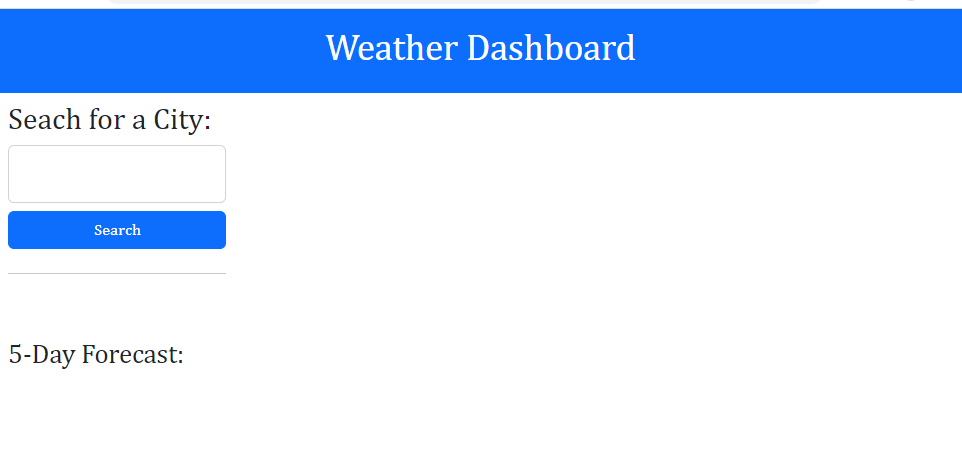

# Drizzily-Bear-Weather-Dash

## Description

As a first foray into server-side APIs, I was tasked with utiliziing Open Weather's current weather information to inform my newest creation - a five day weather forecast application. 

## Usage

This application is still a work in progress. Upon completion one should be able to input a city into the search bar, where it will be saved in a search history and pull up a five day weather forecast based upon Open Weather API current information.

1st version of deployed application: https://brianschapman.github.io/Drizzily-Bear-Weather-Dash/

    
    

